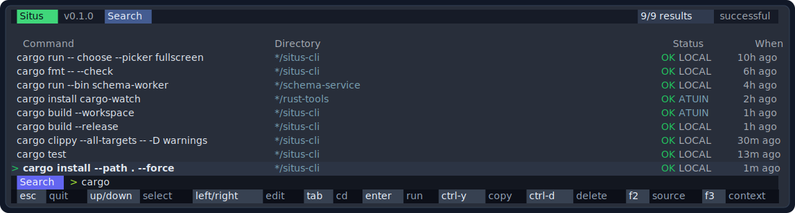
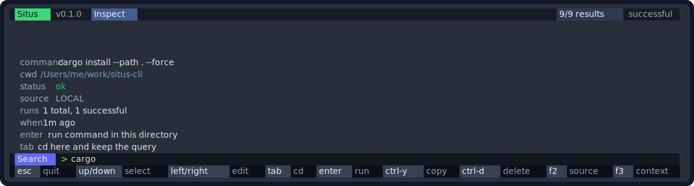
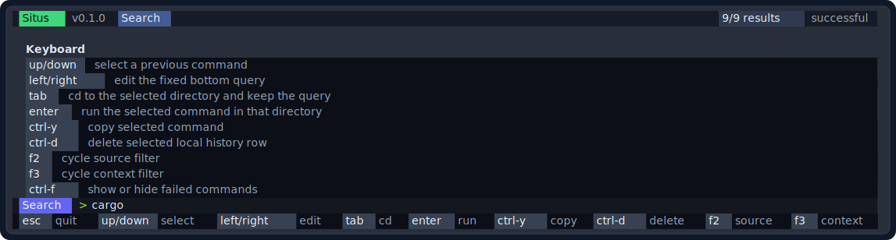
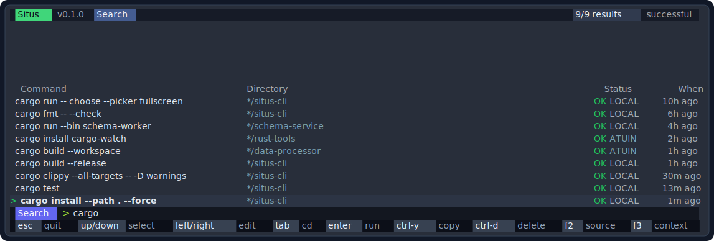
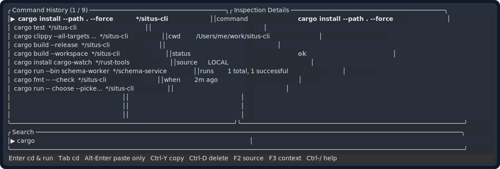
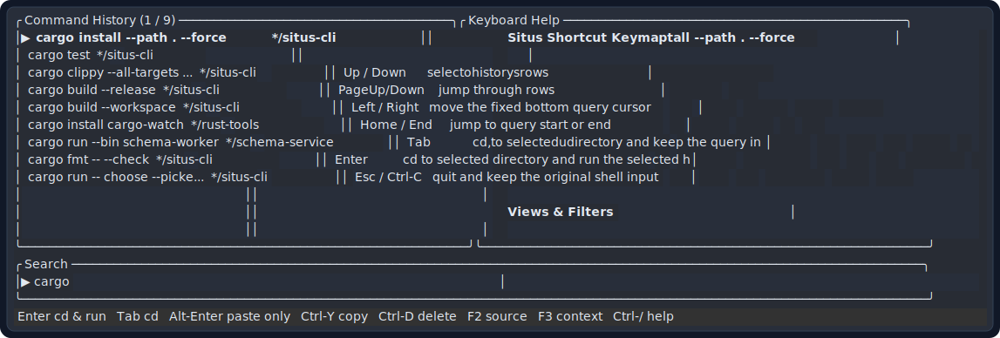

# situs-cli

[](https://github.com/toddkim95/situs/actions/workflows/ci.yml)
[](https://github.com/toddkim95/situs/actions/workflows/security.yml)

[English](../../README.md) | [한국어](../ko/README.md) | [简体中文](../zh-Hans/README.md) | [Español](../es/README.md) | [日本語](README.md)

`situs` は zsh 用の小さな **command cwd resolver** です。

以前にコマンドが実行に成功したディレクトリを記憶し、手動で `cd` することなく、記憶されたディレクトリからそのコマンドを実行またはシェルバッファに準備することができます。

> [!NOTE]
> このドキュメントは日本語翻訳版です。英語の [README.md](../../README.md) が source of truth です。コマンド名、フラグ、環境変数、設定キー、シェルプロトコル値は意図的に翻訳していません。

```text
~/notes
> cargo build
  Ctrl-G を押す

Situs がコンパクトなピッカーを開きます:
  cargo build --release        .../work/app        ok        2h ago
> cargo build
  esc 終了  up/down 選択  tab cd  enter 実行
```

### このツールが存在する理由

1. `/Users/me/work/app` で `cargo build --release` を正常に実行します。
2. 後で、別のディレクトリから `cargo build --release` と入力します。
3. Situs のショートカットキーを押します。
4. 以前に成功した作業ディレクトリを選択します。
5. Situs はシェルの入力を `cd -- /Users/me/work/app && cargo build --release` に変換します。

Situs は完全なシェル履歴の代替品ではありません。Atuin、McFly、fzf、HSTR は優れた履歴検索ツールであり、zoxide は優れたディレクトリ移動ツールです。Situs は、「以前このコマンドはどこで実行できたか？」という 1 つの狭い問題の解決（"command cwd resolver"）に特化しています。

<h2>スクリーンショット</h2>

### インラインピッカー

| 検索 | 詳細 | ヘルプ |
| --- | --- | --- |
|  |  |  |

### フルスクリーンピッカー

| 検索 | 詳細 | ヘルプ |
| --- | --- | --- |
|  |  |  |

## 特徴

- コマンド、cwd、終了ステータス、タイムスタンプ、ソースを記憶します。
- デフォルトで成功したコマンドの実行を優先します。
- 現在のコマンドラインを表示したままにするコンパクトなインラインピッカーを開きます。
- より広い画面を好む場合のために、フルスクリーン TUI ピッカーをサポートします。
- `Tab` キーで、選択したディレクトリとコマンドを実行せずにシェルバッファに準備できます。
- `Enter` キーで、選択したディレクトリに cd し、選択した履歴コマンドを実行できます。
- 完全一致だけでなく、`cargo install`、`cargo install --path`、`cargo install --path .` のような部分一致にも対応します。
- ローカル履歴、Atuin 履歴、現在のディレクトリ、または現在の git ワークスペースでフィルタリングします。
- Atuin の SQLite 履歴を読み取り専用でインポートできます。
- 非 TTY やスクリプト用に、シンプルな行ベースのピッカーを維持します。
- macOS および Linux 上の `zsh`、`bash`、および `fish` シェルに対応しています。

## インストール

### GitHub からのインストール

リポジトリが公開された後:

```sh
cargo install --git https://github.com/toddkim95/situs
```

リポジトリが別のオーナー名またはリポジトリ名で公開された場合は、URL を最終的な GitHub URL に置き換えてください。

### ローカルのチェックアウトからのインストール

```sh
git clone https://github.com/toddkim95/situs
cd situs
cargo install --path .
```

### crates.io からのインストール

クレートが公開された後:

```sh
cargo install situs-cli
```

## クイックスタート

Situs を zsh に追加します:

```sh
eval "$(situs init zsh)"
```

同じ行を `~/.zshrc` の最後の方に追加し、新しいターミナルを開きます。

デフォルトのキーバインドは `Ctrl-G` です。初期化スクリプトをロードする前に変更できます:

```sh
export SITUS_BINDKEY='^G'
eval "$(situs init zsh)"
```

診断の実行:

```sh
situs doctor
```

ピッカーのショートカットを表示:

```sh
situs keymap
```

対話型のセットアップフローを開始:

```sh
situs setup
```

インストールの詳細は [docs/installation.md](../installation.md) にあります。

## 日常的な使い方

通常通りコマンドを実行します。zsh 統合は、対話型コマンドが終了した後に記録します:

```sh
cd ~/work/app
cargo test
```

後で、任意のディレクトリから:

```sh
cargo test
# Ctrl-G を押す
```

ピッカー内での操作:

| キー | アクション |
| --- | --- |
| `Up` / `Down` | 履歴行を選択し、クエリを選択したコマンドと同期する |
| `Left` / `Right` | クエリカーソルを移動する |
| `Tab` | 選択したディレクトリに `cd` し、コマンドをシェルバッファに保持する |
| `Enter` | 選択したディレクトリに `cd` し、選択した履歴コマンドを実行する |
| `Ctrl-F` | 失敗したコマンド履歴の表示/非表示を切り替える |
| `Ctrl-O` | 選択した履歴項目を検査（詳細表示）する |
| `F2` | ソースフィルタの切り替え: all, local, Atuin |
| `F3` | コンテキストフィルタの切り替え: all, directory, workspace |
| `Ctrl-Y` | 選択したコマンドをコピーする |
| `Ctrl-D` | 選択した Situs 履歴行を削除する |
| `Esc` | 終了して元のシェル入力を保持する |

使用方法の詳細は [docs/usage.md](../usage.md) にあります。

## ピッカーモード

インラインピッカー（デフォルト）:

```sh
situs choose --picker inline --command "cargo build"
```

フルスクリーンピッカー:

```sh
situs choose --picker fullscreen --command "cargo build"
```

以下を設定してフルスクリーンをデフォルトにできます:

```sh
export SITUS_PICKER=fullscreen
```

または以下を実行します:

```sh
situs setup
```

複数の可視行が同じディレクトリプレフィックスを共有している場合、Situs はその共通部分を `*` でマスクし、意味のあるパスセグメントをスキャンしやすくします。実際に選択されるディレクトリは依然としてフルパスです。

## Atuin

Situs は、Atuin のデータベースを変更することなく Atuin の履歴をインポートできます:

```sh
situs import atuin
```

検索前に読み取り専用の自動インポートを有効にします:

```sh
situs atuin enable
```

ステータスの確認と無効化:

```sh
situs atuin status
situs atuin disable
```

Atuin 統合の詳細は [docs/configuration.md](../configuration.md) にあります。

## コマンド一覧

```sh
situs init zsh
situs setup
situs doctor
situs keymap
situs atuin enable
situs atuin status
situs import atuin
situs record --cwd "$PWD" --status 0 -- "cargo build"
situs choose --picker fullscreen --mode restore --command "cargo build"
situs choose --context workspace --command "cargo test"
situs choose --print-dir --command "cargo build"
situs run -- cargo build
situs stats
```

コマンドの完全な要約を表示するには、`situs --help` を実行してください。

## 設定

一般的な環境変数:

| 環境変数 | 用途 |
| --- | --- |
| `SITUS_BINDKEY` | zsh キーバインド、デフォルトは `^G` |
| `SITUS_MODE` | zsh 実行モード: `stay` または `restore` |
| `SITUS_PICKER` | ピッカーモード: `inline` または `fullscreen` |
| `SITUS_INLINE_ROWS` | インラインピッカーの行数 |
| `SITUS_HISTORY` | 履歴ファイルのパスをオーバーライド |
| `SITUS_CONFIG` | 設定ファイルのパスをオーバーライド |
| `SITUS_ATUIN_SYNC` | Atuin 同期設定のオーバーライド: `off`、`auto`、`always` |
| `SITUS_LANG` | UI 言語: `en`、`ko`、`zh-Hans`、`es`、`ja` |
| `SITUS_PLAIN` | シンプルな行ベースのピッカーを使用 |

保存先パス、設定ファイルの値、および実行モードの詳細については [docs/configuration.md](../configuration.md) を参照してください。

## 他ツールとの比較

| ツール | 主な役割 | Situs との関係 |
| --- | --- | --- |
| Atuin | 豊富なシェル履歴、コンテキスト、同期 | Situs は Atuin からインポートでき、より小さな cwd 解決ワークフローを使用します |
| McFly | スマートなシェル履歴検索 | Situs は、すでに入力し始めているコマンドが実行された cwd を解決します |
| fzf | 汎用ファジーファインダとシェルキーバインド | Situs は専用に設計されたピッカーとシェルプロトコルを持ちます |
| zoxide | ディレクトリ移動 | Situs はディレクトリの使用頻度ではなく、コマンド履歴に基づいてジャンプします |
| HSTR | シェル履歴のサジェストボックス | Situs はコマンド、cwd、ステータス、アクションセマンティクスを一体で保持します |

詳細な比較は [docs/comparison.md](../docs/comparison.md) を参照してください。

## 開発

ローカルで完全な検証マトリックス（コードフォーマット、clippy、ユニット/受け入れテスト、翻訳、PTYスモークテスト）を一度に実行します：

```sh
scripts/verify-all.sh
```

個別のステップを実行することもできます：

```sh
cargo fmt -- --check
cargo test --locked
cargo clippy --locked --all-targets -- -D warnings
cargo build --locked
cargo package --locked --no-verify
scripts/verify-doc-i18n.sh
scripts/verify-picker-modes.sh
```

RustSec アドバイザリアーカイブ監査は GitHub Actions で実行されます。ローカルでチェックするには:

```sh
cargo install cargo-audit --locked
cargo audit
```

貢献者向けの詳細は [CONTRIBUTING.md](../../CONTRIBUTING.md) および [docs/development.md](../docs/development.md) を参照してください。

ユーザー向けの機能を追加または変更した場合は、英語、韓国語、簡体字中国語の i18n メッセージカバレッジを更新するか、同じ変更の中で明確なフォールバックをドキュメント化してください。ランタイムと README 翻訳の保守については [docs/i18n.md](../docs/i18n.md) に記載されています。

README スクリーンショットを再生成するには:

```sh
scripts/capture-screenshots.js
```

スクリーンショットスクリプトは、`fixtures/screenshot-history.tsv` のモック履歴データで実際のピッカーを実行し、各キャプチャを最大 3 回再試行します。

## トラブルシューティング

まず以下から始めてください:

```sh
situs doctor
```

一般的な解決策:

- `eval "$(situs init zsh)"` が `~/.zshrc` にロードされていることを確認します。
- `SITUS_BINDKEY`、`SITUS_PICKER`、または `SITUS_MODE` を変更した後は、新しいシェルを開きます。
- `cargo install --path . --force` で再インストールした後は、すでにロードされている zsh ウィジェットをリフレッシュするために `source ~/.zshrc` を実行するか、新しいターミナルを開きます。
- `situs stats` を実行して、履歴が記録されていることを確認します。
- Atuin の結果が表示されない場合は、`situs atuin status` を実行します。
- ターミナルのレンダリング問題を特定するために、`SITUS_PLAIN=1` を設定します。

その他のケースは [docs/troubleshooting.md](../docs/troubleshooting.md) に記載されています。

## 貢献について

バグリポート、UX に関する提案、および小さく絞られたプルリクエストを歓迎します。ピッカーの変更には、ターミナルプロトコルのわずかな変更が実際のシェルワークフローを壊す可能性があるため、ユニットカバレッジと zsh/PTY スモークカバレッジの両方が必要です。

プルリクエストを開く前に [CONTRIBUTING.md](../../CONTRIBUTING.md) をお読みください。

## セキュリティ

セキュリティに敏感な報告についてはパブリックな issue を開かないでください。[SECURITY.md](../../SECURITY.md) を参照してください。

## ライセンス

MIT。詳細は [LICENSE](../../LICENSE) を参照してください。
